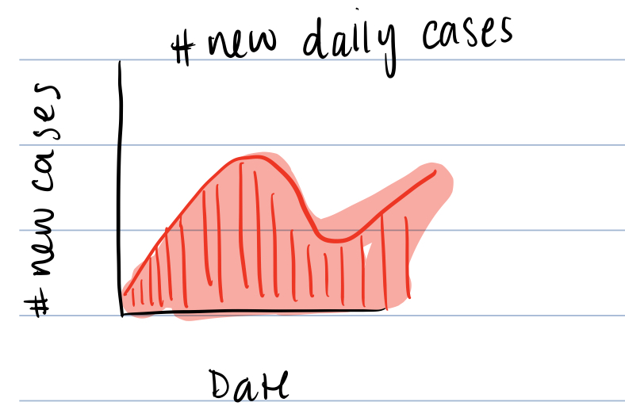
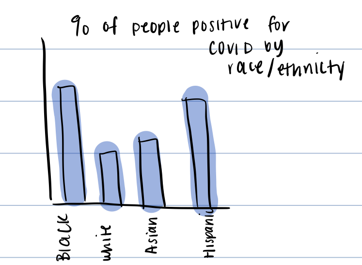
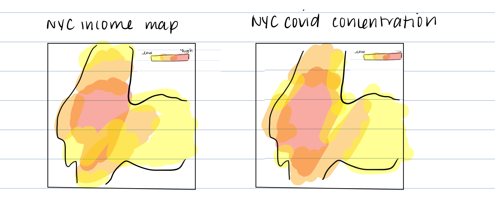
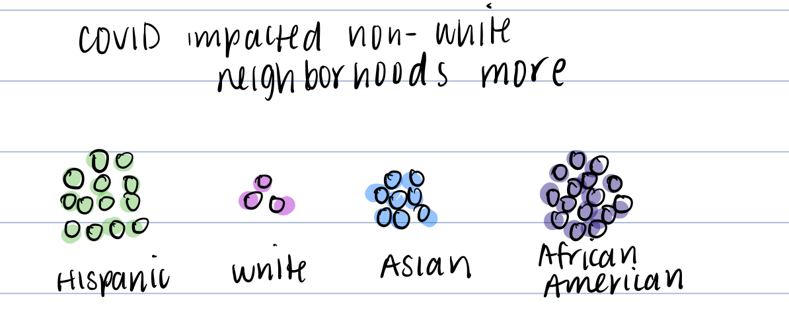
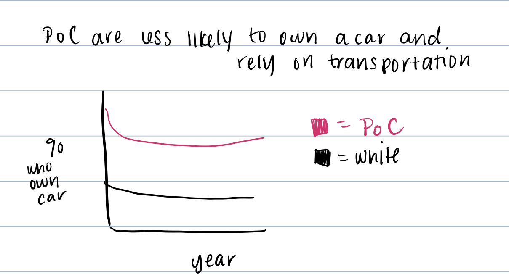
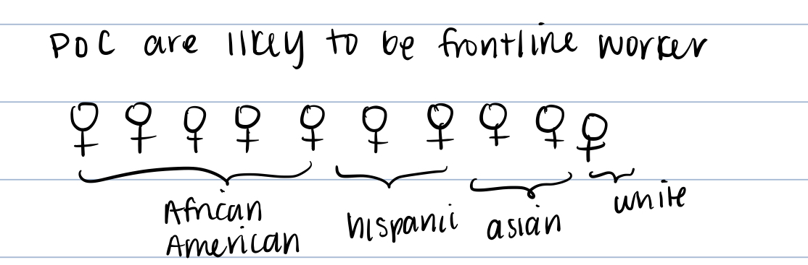
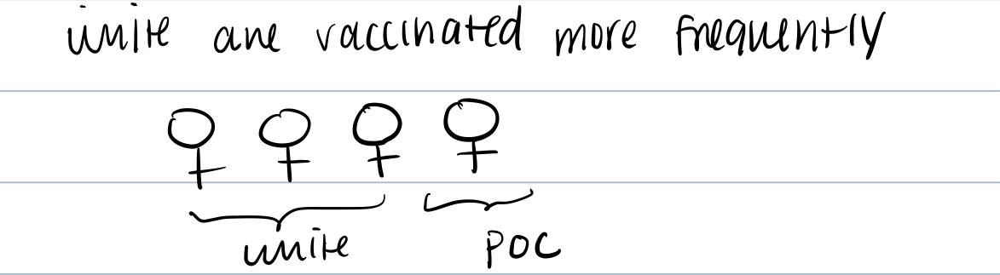

# Part 1: Final Project Outline

---
### Table of Context

* Topic
* Call to Action
* Outline/Sketches
* Data
* Method and Medium

# Part 1
---
 
# **Topic**

Topic: : How health disparities in New York City is hindering COVID-19 recovery

New York City was the epicenter of the COVID-19 pandemic in March 2020, resulting in the entire region experiencing a lot of trauma. Even though the COVID situation in NYC is much more manageable, there are still some issues some races are experiencing more than others. 

**Call to Action**

The purpose of this story is to share what has been going on and who is currently at risk. That way, I can provide recommendations and share resources in order to take action, work with local organizations to educate low-income locals, call a representative, and/or just be knowledgeable. 

# Outline/Sketches
I thought using Shorthand would be good to show how the pandemic played out in COVID-19 and how inequality was apparent throughout all of it. I was going to break up the story into two parts. First part would be about the rise of the pandemic in NYC, its impact while it is the epicenter, and illustrate why certain neighborhoods are hit harder. The second part would be after restrictions were put into place and the road to herd immunity to show that even recovery is still not consistent throughout. 

**Tale of 2 cities: How Inequalities are Worsening COVID-19 in New York City**

**Part 1: The rise of the pandemic in New York City** 
Basic overview: New York City was considered the epicenter of the pandemic. The number of cases grew rapidly, which I can use by visualizing the graph that was for New York City

"This virus is the great equalizer" Andrew Cuomo, Governor of New York State, said on 03/21/2020. While Cuomo was insisting that virus doesn't consider factors such as race, religion, economic class, and gender, certain races were getting more infected than others. 

This leads into the question of why are some races being more infected than others? 

Income and COVID cases are associated with one another

Income is associated with health disparities that existed prior to COVID, which shows in different ways.

More impacted neighborhoods are low income and non-white

PoC are less likely to have a car --> meaning that they are commuting around NYC compared to their white counterparts 

**Part 2: June 2021 - Present: The road to herd immunity is shaky** 

Despite cases dropping, there are still barriers faced by minorities (who are still the most impacted) Whites are more likely to be vaccinated than any other race even though they are not impacted the most (top). Which is almost contradictory as PoC are considered front line workers and cannot stay at home (bottom)

What can we do about this? 

**Recommendation** 

- Volunteer for local community outreach to raise awareness of resources low-income areas can use
- Call local representatives to provide aid in order to alleviate some of the health disparities 

# Data

**Data source 1: COVID tracking project**
Link: https://covidtracking.com/

This dataset was chosen because I needed an overall view of COVID in New York City. This would be used to make the figure diagram that maps out the number of new cases coming into New York City daily. This organization scrapes data acros all health departments to keep the numbers as accurate as possible, I thought this would be the most reliable source. This will be used to create the first graph of the overall COVID classes.

**Data source 2: NYC Gov**
Link: https://www1.nyc.gov/site/doh/covid/covid-19-data.page

This dataset comes from the NYC Department of Health and Mental Hygiene. This site contains a series of datasets that can be used to build the other graphs. The datasets are broken up based on neighborhood and zip code. It includes:

- Hospitalization Rates
- COVID cases by neighborhoods
- Vaccinations 

This can be used to build all the visualizations using Tableau and Flourish through this. 

**Data source 3: National Equity Atlas**
Link: https://nationalequityatlas.org/

This dataset comes from the National Equity Atlas, which contains datasets about racial equity in the US. This dataset would be used for any visualizations about having vehicles. These visualizations would be used to indicate that those who are people of color are less likely to have a vehicle and rely in NYC transportation (meaning they are more suspectable to contracting COVID)

**Data source 4: US Census Data**
Link: https://www.census.gov/data/developers/data-sets/acs-5year.html

This dataset comes from the US Census that collects information about the job occupations of those working. This will help me figure out the demographics of the frontline workers and to visualize how those who are frontline workers are not necessarily the same people being vaccinated (which in NYC is ~75% people of color).

# Method and Medium

The medium I will likely be using for this project is Shorthand. Since what I have in mind is a timeline of the pandemic from March 2020 - present day and how different areas were impacted, the idea of the viewer able to scroll down and see it as pandemic progresses. Based on the outline stated above, I will likely first build the visuals to see how they look and make sure they look how I imagine using Flourish and Tableau most likely. At this point, I will see if the visualizations best represent the data the way I imagine them too. If they do not and there is a better way to make it flow, I may switch up the visualization. 

After the visualizations, I will search for photos and backgrounds for the visualizations. Only after I manage to gather the appropriate media, then I will start building it on shorthand and adding the final touches.

