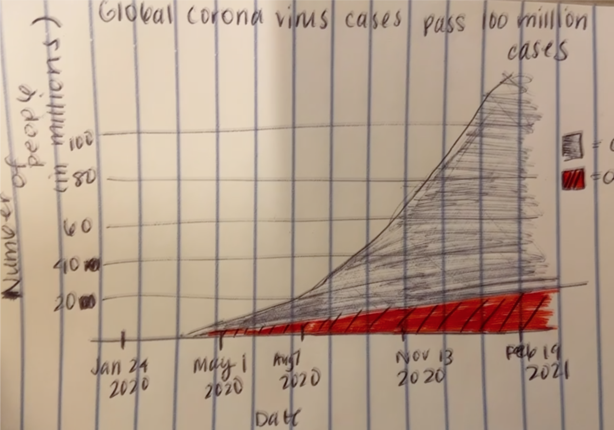

# Prior to assignment: find a data visualization 

Source: https://www.bbc.com/news/world-51235105

The visualization that I will be focusing on for this assignment is titled "Global coronavirus cases pass 100 million"

# Wireframe a solution

Quickly drew a sketch of what I envisioned to look like based on comments I made earlier

Note: got cut off while taking the image but there is a legend on the right hand side. Red indicates deaths and the black is suppose to represent confirmed cases. 

# Testing the solution

Interviewee 1: This person (my roommate) was able to quickly realize what she was reading. She immediately recongized what the graph was trying to do and the color coding. She was a little confused with the title (which I still left as "Global coronavirus cases pass 100 million cases") because she didn't understand why it was important to mention that. I responded by showing her the context of the visualiation with the rest of the website. She understood it then why it was titled as so. She was also confused of whether the total number of cases and deaths are aggregated or are they showing the # of new COVID cases per day (something that I did not take into consideration of indicating). She got the gist of what the visualization was trying to show but she had some confusion. 

Interviewee 2: This person (my friend from undergrad) realized pretty quickly what the graph was trying to tell. She has a background in Public Health and had a strong interest in infectious diseases, so she was already interested in COVID to begin with. She got what the graph was trying to say and generally throught it was to the point. What she also mentioned was interesting about it was the "so what?" factor. She understood what it was trying to say but there was no clear call for her action. I wasn't sure if it was because she already had a good knowledge about COVID already and this wasn't new to her, or is there a larger issue where she didn't know what to do with the information. She asked if it was smart to break it down by continents to better show which continents are experiencing a larger amount of cases. 

I think what I got from this was that context matters. Someone who doesn't have a background in tangent to the pandemic would be confused about how the information was compiled and how it was being measured. On the other hand, the other person with a background in public health was trying to think beyond the graph and the potential implications. When I first looked at the graph, I assumed that the main idea could be the title to help guide the users through the visualization. However, that isn't always the case. Also something that looked very clear to me wasn't as clear to other people depending on their background. 

# Recreated data visualization

This is my visualization: 

I chose this visualization because I found it interesting that among the multiple interactive visualizations they had on this page, they had this simple area graph. It got me thinking why, and I ended up looking at it the longest out of all of them. I was trying to figure out why they chose to add this and what additional knowledge do I gain from it. Then I began to notice other smaller details and how I thought about the visualization that could've been streamlined quicker. Therefore, this is the one I ended up choosing. For the most part, the graph was overall fine, informative, and coming from realiable source. I think the graph chosen was a good one. I was thinking about changing it to a basic line graph, but what I like (and something both the people I interviewed pointed out), but the area graph and the shading below the line helps them notice the proporation between deaths and the number of confirmed cases. This would've been more difficult to measure without the shading since the shading was able to provide a magnitude of some sort. 

However, there were a few little details I noticed that could be fixed. 

This is the new creation based on what I did with Tableau. This required some data manipulation done in R (confirmed cases and death cases were broken down by country and each were in a separate excel sheets) before importing. I kept the colors the same but I put the deaths on top of the confirmed cases (compared to what was done in BBC). Readers tend to go up before looking down at the visualization. Putting the smaller one on top with a darker (more bold) red color will ensure that the viewer can see that the red was in there before looking at the larger portion (which is in orange). Rather than keeping the text in the graph, I put a legend to identify the colors. When I did the wireframe and showed it to others, there were still some confusion about the graph, much to my surprise. Per the Interviewee 1's suggestion, I changed the title and indicated that the number of cases are cummulative and just showed a general overview. I additionally noticed in the BBC version of this is that they did not put the year, which I found a little confusing at first because it looked like the months were out of order so I included the year so it flows better. I was also asked why the dates on the BBC page were chosen like that so I tried to choose an x-axis that was more obviously consistent.

This reminded me that even if I created a visualization that was perfect in my mind, everyone is coming with different biases. I personally do not like the title as much as I prefer to have the "main idea" as the title so I can help guide my reader. However, some people are still confused about how the data is compiled and how COVID cases were being recorded as. Clarifying it in the title should ideally allow people to make more informative conclusions. Changing the title changed the narrative of what I wanted to show. BBC wanted to show that the number of total coronavirus cases was passed 100 million, but this chart shows the general overview of COVID since the start of the pandemic.  

To fit the storyline better on the BBC page, I would put this diagram at the very beginning before any other visualization. It gives a good overview and it follow up better with the next visualization a lot better than where it is currently positioned now. While this is a visualization, I think this could do well as a dashboard as well. I think having a filter to look globally vs a continent would allow viewers to have more insight into what was happening around the world. That way, for those who are interested in the breakdown, they can see how it looks in each contienent, get a better set of the trends happening there overall. That way, when you scroll down the BBC page, it will lead you to the next visualization is broken down by the country. I think this would be a better idea to show a gradual braekdown of COVID from global --> continent --> country. Though I can't show it, I think the idea of "so what?" is important. As the other interviewee mentioned, it felt random to some people and there was nothing really much to think about beyond it. I think adding an interactive part will not only fit with the flow of the page better but it allows people to think more deeply and be able to answer with more follow up questions. I think this is a crucial part of story telling, and guiding the readers to not only what you want to share, but what they want to know as well. 

