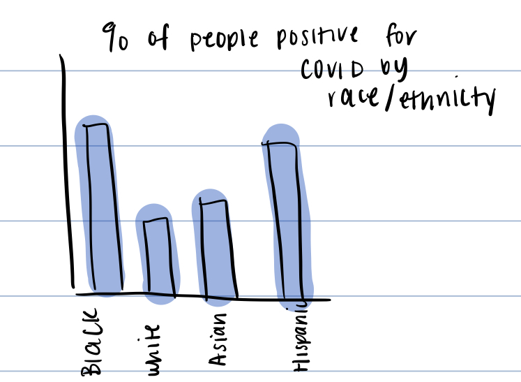
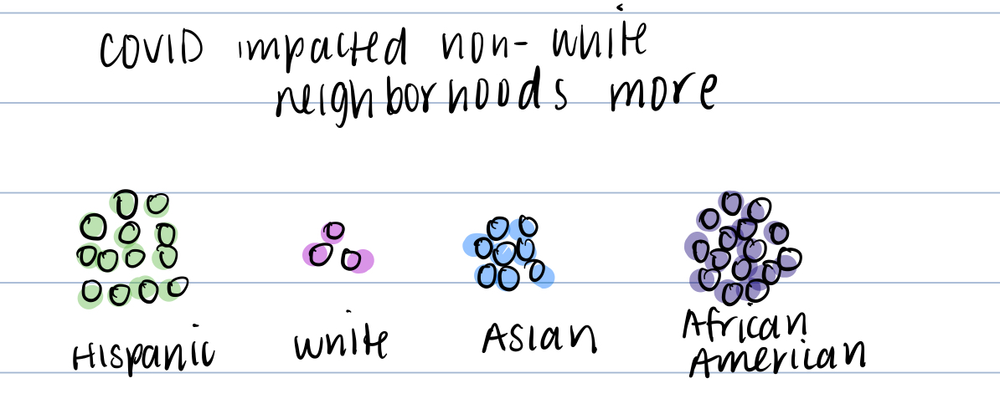
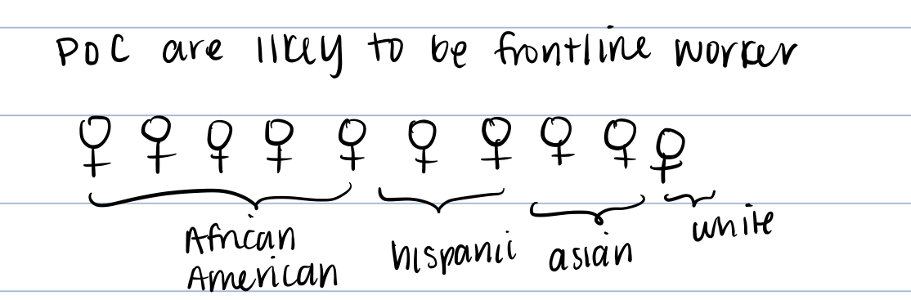

# Final Project Outline

---
### Table of Context

1. Part 1
    * Topic
    * Call to Action
    * Outline/Sketches
    * Data
    * Method and Medium
2. Part 2
    * Wireframe
    * User research
    * Interviews
    * Moodboard

# Part 1
---
 
**Topic: How health disaprities in New York City is hindering COVID-19 recovery**

New York City was the epicenter of the COVID-19 pandemic in March 2020, resulting in the entire region expereiecing a lot of trauma. Even though the COVID situation in NYC is much more manageable, there are still some issues some races are expereicing more than ohters. 

**Call to Action**

The purpose of this story is to share what has been going on and who is currently at risk. That way, I can provide recommendations and share resources in order to take action, work with local organizations to educate low-income locals, call a representative, and/or just be knowledgeable. 

# Outline/Sketches
I thought using Shorthand would be good to show how the pandemic played out in COVID-19 and how inequality was apparent throughout all of it. I was going to break up the story into two parts. First part would be about the rise of the pandemic in NYC,its impact while it is the epicenter, and illsutrate why certain neighborhoods are hit harder. The second part would be after restrictions were put into place and the road to herd immunity to show that even recovery is still not consistent throughout. 

**Tale of 2 cities: How Inequalities are Worsening COVID-19 in New York City**

**Part 1: The rise of the pandemic in New York City** 
Basic overview: New York City was considered the epicenter of the pandemic. The number of cases grew rapidly, which I can use by visualizing the graph that was for New York City

"This virus is the great equalizer" Andrew Cuomo, Governor of New York State, said on 03/21/2020. While Cuomo was insisting that virus doesn't consider factors such as race, religion, economic class, and gender, certain races were getting more infected than others. 

This leads into the question of why are some races being more infected than others? 

Income and COVID cases are associated with one another

Income is associated with health disaprities that exsited prior to COVID, which shows in different ways.

Worstly impacted neighborhoods are low income and non-white

PoC are less likely to have a car --> meaning that they are commuting around NYC compared to their white counterparts 

**Part 2: June 2021 - Present: The road to herd immunity is shaky** 

Despite cases dropping, there are still barriers faced by minorities (who are still the most impacted) Whites are more likely to to be vaccinated than any other race even though they are not impacted the most (top). Which is almost contradictory as PoC are considered front line workers and cannot stay at home (bottom)

What can we do about this? 

**Recommendation** 

- Volunteer for local community outreach to raise awareness of resources low-income areas can use
- Call local representatives to provid aid in order to alleviate some of the health disaparities 

# Data

COVID DATA

**Datasource 1: COVID tracking project**
Link: https://covidtracking.com/

This dataset was chosen because I needed an overall view of COVID in New York City. This would be used to make the figure diagram that maps out the number of new cases coming into New York City daily. This organization scrapes data acros all health departments to keep the numbers as accurate as possible, I thought this would be the most reliable source. This will be used to create the first graph of the overall COVID classes.

**Datasource 2: NYC Gov**
Link: https://www1.nyc.gov/site/doh/covid/covid-19-data.page

This dataset comes from the NYC Department of Health and Mental Hygiene. This site contains a series of datasets that can be used to build the other graphs. The datasets are broken up based on neighborhood and zipcode. It includes:

- Hospitalization Rates
- COVID cases by neighborhoods
- Vaccinations 

This can be used to build all the visualizations using Tableau and Flourish through this. 

**Datasource 3: National Equity Atlas**
Link: https://nationalequityatlas.org/

This dataset comes from the National Equity Atlas, which contains datasets about racial equity in the US. This dataset would be used for any visualizations about having vehicles. These visualizations would be used to indicate that those who are people of color are less likely to have a vehicle and rely in NYC transportation (meaning they are more suspectible to contracting COVID)

**Datasource 4: US Census Data**
Link: https://www.census.gov/data/developers/data-sets/acs-5year.html

This dataset comes from the US Census that collects information about the job occupations of those working. This will help me figure out the demographics of the frontline workers and to visualize how those who are frontline workers are not necessarily the same people being vaccinated (which in NYC is ~75% people of color).

# Method and Medium

The medium I will likely be using for this project is Shorthand. Since what I have in mind is a timeline of the pandemic from March 2020 - present day and how differents areas were impacted, the idea of the viewer able to scroll down and see it as pandemic progresses. Based on the outline stated above, I will likely first build the visuals to see how they look and make sure they look how I imagine using Flourish and Tableau most likely. At this point, I will see if the visualizations best represent the data the way I imagine them too. If they do not and there is a better way to make it flow, I may switch up the visualization. 

After the visualizations, I will search for photos and backgrounds for the visualizations. Only after I manage to gather the appropiate media, then I will start building it on shorthand and adding the final touches. 

# Part 2
---

Based on feedback from what I got from class, this is the intial wireframe I have and the story progression I wanted to share.

**insert story**

**User research**

The purpose of this was to inform the public. I think while the general public (those in and out of New York City) could benefit from being aware. The people who are likely to take actions are the following groups:

* Local residents: Bringing awareness to your neighborhood can allow them to take direct actions. 
* Non-profits: Visuals can help advocate for their causes and aiding in community outreach
* Local and state politicians: Visuals can help advocate for their causes and aiding in community outreach. Also helps with raising awareness of the issue and how it is affecting the city (which is a main source of financial income to the state)

**Interviews**

I tried to interview one person who would repersent the general public and not from New York City, one person who has a background in healthcare but also not from New York City, and someone who is from New York City and has a knowledge of healthcare. I specifically picked out those people because I wanted to try to get a variety of different audiences. Though my audience is primarily targetted at New York City, I wanted to gauge to see if a complete outsider could understand what is happening clearly. 

The questions I asked were the following:

*1. Did you know this information before reading it?*

*2. What problem do you think the visualizations are trying to tell you?*

*3. Who do you think this is targeted for?* 

*4. What is the proposed solution for this problem?*

*5. What did you find confusing? What would you change?*

*6. Based on what you have seen, do you feel compelled to take action? Why or why not?*

*7. Do you have additional questions after looking at it?*

*8. What would you have done differently?*

| Questions | Person 1 (Non-NY, young 20s, represents general public)| Person 2 (Non-NY, young 20s, has a background in healthcare)| Changes I should make|
| --- | --- | --- | --- |
| Did you know this information before reading it? | He noted that he use to live in New York City a few years, but is originally from Pennsylvania. Therefore, his concern is primarly on what is going on in Pennsylvania. "I knew it was a problem but I didn't know the statistics" | "I never really thought that it was that big of a problem until I saw it"| N/A|
| What problem do you think the visualizations are trying to tell you? | He realized that there is a staggering amount of COVID cases in New York City and he thought the purpose of this was to show where it is happening and why that is the case | She was able to quickly undestand what the visualizations were trying to tell her. "The problem of racial dispartieis in terms of COVID impact"| I should think of a way to state more clearly that the racial disaprities are making the situation worse. I think people generally realize that race plays a role but maybe stating it more clearly can help with the narrative|
| Who do you think this is targeted for? | 1) The General Population so they are informed with what is going on. 2) State and local politicians as it is possibly useful to start dicussions and visualize what is happening. 3) Hospitals as there is a focus on hospitalizations | She wasn't entirely sure. There was a pause before she said "people who want to access the health of neighborhoods?"| N/A - This was originally intended to be more informative. I didn't think about hospitals being interested in this so that is a new audience to know and try to consider when building the final recommendations|
| What is the proposed solution for this problem? | Proposed solutions is to call your representative and community outreach | She remembered it and said to call representatives and community outreach| Make the recommendations more flashy so it's obvious what it is. They primarily remembered to call your representatives one but not the volunteer one right away| 
| What did you find confusing? What would you change? | None. He found it useful and very clear. In the solution thogh, he suggested that he would break it up depending on who your target audience is (i.e what should the general public do, what should politicians do, what should hospitals do) since it affects all of them | She found some of the graphs a little confusion that showed the %. She thinks I should add more descriptive titles and captains.| I will be making the titles and captions more clear. After talking to Person 2, I may try to incorporate more infographs and limit the bar charts when possible|
| Based on what you have seen, do you feel compelled to take action? Why or why not? | No because he is not particulary involved in community outreach and not from New York City. He did mention though that it made him more aware of what is happening | "Yes because there is an obvious disaprity between people, and they need justice"| N/A|
| Do you have additional questions after looking at it? | The concept is pretty simple and easy to understnad. "I'm the general public. I'm useless" | Nothing| N/A- seems like everyone is getting the point|
| What would you have done differently? | He reinterated about breaking down the solutions | She didn't think besides what she mentioned she would've changed anything| I will breakdown the solutions based on the target audience so the recommendations are appropiate to whoever is reading it|

Common themes: I think for the most part, there is little confusion, which hopefully means that there is a clear story and there is a clear call to action. This could be credited to discussing my initial Part 1 with peers from the class, which asked additional questions that I was able to include. From Part 1 to Part 2, I also included information about the deaths and why the number of deaths were coming up. I also included information about the fact that non-whites are more likely to have pre-existing conditions due to their surroundings in order to further explain why they are more likely to die from COVID-19. 

Something I asked was how to make it more engaging? I was worried that there is too many bar graphs and was brainstorming other ways to switch it up. For example, for the story about "Some races are more affected than others" has bar graphs, but I was thinking if there is another way to visualize that. After speaking to the interviewees, I may switch it into shaded bars so it can be better seen that it is a proportion of people because I was asked about that. Something I will definitely consider is to break up the solutions more clearly and make it specific depending to the audience I am going to communicate to. It didn't occur to me that it will have multiple audiences and should be addressed accordingly so I will definitely do that. I also noticed my color choices are a little out there and not consistent so based on themoodboard I create, I will be using those colors to keep the theme consistent. 
